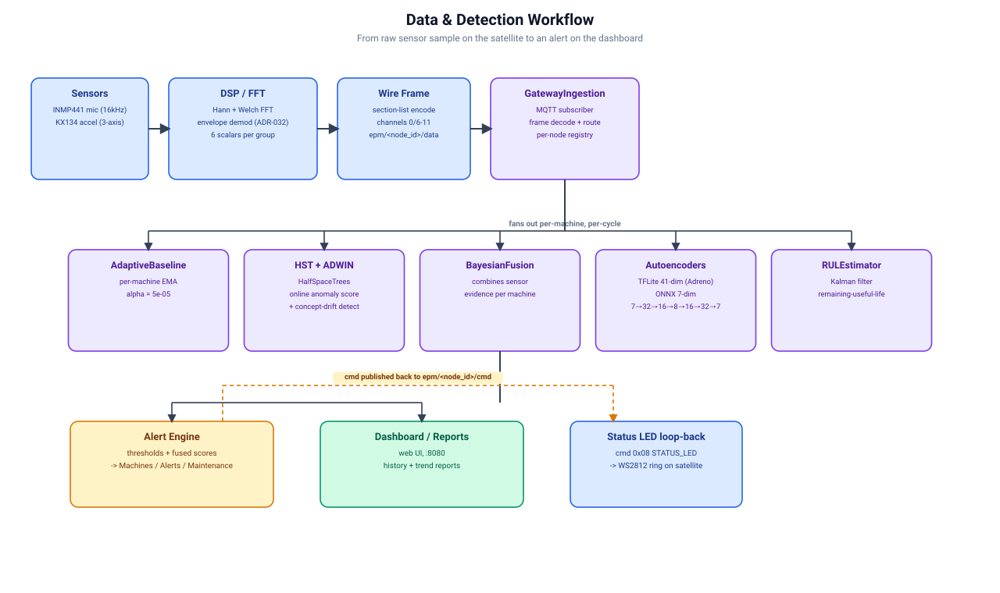

# EPM System Architecture

**As-built reference for the EdgeAI Predictive Monitor.** Describes what the code does
today (2026-08-07), not aspirational design. Satellite firmware = XIAO ESP32-S3;
gateway = the `gateway/` Python package. The laptop + `tools/devrig/` path is the one
actually validated against real hardware end-to-end
(`docs/performance/HARDWARE_INTEROP_TEST.md`); an Arduino Uno Q base station is the
other supported target but hasn't had the same hardware verification. Local Mosquitto
broker either way. Wire-contract source of truth:
[`docs/BASE_STATION_CONTRACT.md`](docs/BASE_STATION_CONTRACT.md).

---

## 1. End-to-end data flow

```
┌───────────────────────────── XIAO ESP32-S3 satellite ─────────────────────────────┐
│                                                                                    │
│  I2S mic (INMP441/ICS-43434)          KX134 SPI IMU (real driver by default;       │
│        │ 16 kHz, 32-bit slots               accel_stub.c only under Kconfig        │
│        ▼                                     EPM_ACCEL_USE_STUB — ADR-017/ADR-024) │
│  mic_task.c (I2S DMA capture, core 0,   imu_task.c (core 0, prio 3)                 │
│    prio 5, drivers/mic_inmp441_i2s.h)     • hal_accel_read_block() X/Y/Z            │
│    • DC-remove, normalise                 • Hann → 2048-pt FFT ×3 (sequential)      │
│    • RMS/crest/kurtosis/std/skew (SIMD)   • envelope demod ×3 (band + amplitude     │
│        │ raw_mic_block_t                    detect, epm_dsp/envelope.c, ADR-032)    │
│        ▼  (esp_ringbuf, zero-copy) ──▶ raw_q ──▶ │ imu_frame_t                      │
│                                                  │                                  │
│  dsp_task.c (core 1, prio 6)                │                                       │
│    • Welch overlap (adaptive)               │                                       │
│    • Hann → 1024-pt FFT (SIMD)              │                                       │
│    • power-avg over spec_avg_n              │                                       │
│    • spectral centroid                      │                                       │
│        │ mic_frame_t                        │                                       │
│        ▼ dsp_q (depth-1 overwrite)          ▼ imu_q (depth-1 overwrite)             │
│  ┌──────────────────── net_task.c (core 0, prio 4) ──────────────────────┐         │
│  │  recv mic+imu → encode section-list frame (epm_codec) → MQTT publish   │         │
│  │  on epm/<node_id>/data (QoS 0, esp-mqtt)                               │         │
│  │  subscribe epm/<node_id>/cmd (QoS 1) → decode/dispatch → drive RGB LED │         │
│  └───────────────────────────────┬───────────────────────────────────────┘         │
└──────────────────────────────────│─────────────────────────────────────────────────┘
                                    │  MQTT over WiFi → Mosquitto :1883
                                    ▼
┌────────────────────── Gateway — gateway/ (Python package) ─────────────────────────┐
│  ingestion/mqtt_subscriber.py — subscribes epm/+/data, decodes section-list frames │
│    • routes decoded sections into PipelineManager (registry.py tracks per-node      │
│      sensor_config/input_dim, first-frame-commits)                                 │
│  pipeline/ — features → OnlineDetector (HST) + AdaptiveBaseline z-scores            │
│             → BayesianFusion posterior P(fault) → RULEstimator                     │
│             → alerting.py (OK/WARN/FAULT, streak hysteresis)                       │
│  ingestion/mqtt_publisher.py — publishes STATUS_LED commands on epm/<node_id>/cmd  │
│  persist: CSV per-satellite + SQLite epm.db (WAL), via pipeline/storage.py          │
│  api/ — dashboard HTTP server                                                       │
│                                                                                       │
│  Legacy dev-only path (ADR-028, no broker needed): ingestion/tcp_legacy.py listens   │
│  on TCP :5100 for tools/satellite_sim.py, feeding the same PipelineManager.          │
└────────────────────────────────────────────────────────────────────────────────────┘
```


Generated workflow diagram: sensor sample to dashboard alert.

---

## 2. Firmware task & queue map

Boot order (`app_main`, [main.c](src/main.c)): NVS → netif/event loop → FFT twiddle
table (once, size `FFT_IMU_N`) → RGB task → **WiFi RF init before any I2S/DMA** (avoids
`TG1WDT_SYS_RST` from I2S interrupts during the RF scan) → wait ≤30 s for IP →
mic/dsp/imu/wifi tasks → diagnostics task.

| Task | Core | Prio | Stack | Role |
|---|:--:|:--:|:--:|---|
| `dsp_task` | 1 | 6 | 6144 | 1024-pt mic FFT, Welch overlap, power-avg, centroid |
| `mic_task` | 0 | 5 | 8192 | I2S capture, DC-remove, time-domain stats (SIMD) |
| `imu_task` | 0 | 3 | 4096 | 3× 2048-pt IMU FFT (real KX134 SPI by default; synthetic stub only under Kconfig `EPM_ACCEL_USE_STUB`) |
| `net_task` | 0 | 4 | 4096 | section-list frame assembly, MQTT publish (`epm/<node_id>/data`), `cmd` subscribe/dispatch |
| `wifi_provision_task` | 0 | 2 | 4096 | captive-portal provisioning state machine (`docs/decisions/ADR-031-*.md`) |
| `rgb_led_task` | 1 | 3 | 3072 | NeoPixel/WS2812 RGB animation by default (`display_ledc.c` plain-LEDC fallback under Kconfig `EPM_DISPLAY_USE_LEDC`) |
| `diagnostics_task` | 0 | 1 | 3072 | 30 s stack-HWM / heap / per-module stats log |

> IMU is priority 3 (below `net_task`=4) by deliberate design so the WiFi/MQTT
> stack is never starved. WiFi STA lifecycle itself (join/retry) is event-driven
> with no task of its own (`docs/decisions/ADR-022-wifi-task-revived.md`); only
> provisioning gets a dedicated task. Authoritative priority/stack values are the
> `#define`s at [src/epm_config.h:184-196](src/epm_config.h#L184-L196).

### Inter-task channels

| Channel | Type | Producer → Consumer | Payload |
|---|---|---|---|
| `raw_q` | `esp_ringbuf` NOSPLIT, 10 KB DRAM, zero-copy | `mic_task` (c0) → `dsp_task` (c1) | `raw_mic_block_t` (~4120 B): DC-removed float block + rms/crest/kurtosis/dc/clip |
| `dsp_q` | queue depth-1, `xQueueOverwrite` | `dsp_task` (c1) → `net_task` (c0) | `mic_frame_t`: 512-bin dBFS FFT + stats + centroid |
| `imu_q` | queue depth-1, `xQueueOverwrite` | `imu_task` (c0) → `net_task` (c0) | `imu_frame_t`: 3× 1024-bin dBFS FFT + per-axis stats |
| RGB state | single-slot queue, last-write-wins | any task → `rgb_led_task` (c1), via `rgb_led_set_state()` | `rgb_led_state_t` |
| RGB remote override | same single-slot queue | `net_task` (c0), from a decoded `STATUS_LED` MQTT command → `rgb_led_task` (c1), via `rgb_led_set_remote()` | raw `(rgb, mode, period_ms)` — bypasses the local state enum (ADR-025) |

Cross-boundary summary: FFT-heavy compute lives on **core 1**; capture + radio on
**core 0**. Overwrite queues mean the newest frame always wins (a backlogged consumer
drops stale data rather than blocking a producer). The v1/v2 byte-reply adaptive-sensing
feedback loop from the old TCP protocol (`g_adapt_overlap_pct`/`g_adapt_spec_avg_n`) no
longer exists — MQTT command traffic is limited to the `STATUS_LED` type today.

### Memory placement (deliberate)

- **Internal DRAM (DMA-safe):** I2S `raw_buf` (`DMA_ATTR`), mic→dsp ring storage
  (`DRAM_ATTR`), RGB pattern tables + anim state (`DRAM_ATTR`, ISR-reachable when
  flash cache is off). GDMA cannot safely reach PSRAM through cache during
  concurrent WiFi DMA, so these stay internal.
- **PSRAM (`EXT_RAM_BSS_ATTR`):** `dsp_task` `s_mag_db` (2 KB), `imu_task` `s_frame`
  (12 KB), and `net_task`'s cached `s_last_mic`/`s_last_imu` frames (~14.5 KB
  combined — too large for `net_task`'s 4 KB stack). The old TCP protocol's
  128 KB / 4 s snapshot pre-trigger ring (`EPM_SNAPSHOT_REQUEST`) was removed along
  with the v1/v2 reply mechanism — no equivalent exists on the MQTT path today.

---

## 3. Wire protocol

Authoritative reference: [`docs/BASE_STATION_CONTRACT.md`](docs/BASE_STATION_CONTRACT.md)
(verified live against the reference base-station repository). Summary below. All multi-byte
fields little-endian.

**Transport:** MQTT to Mosquitto (`components/epm_drivers/link_mqtt.c`, esp-mqtt).
A satellite publishes to `epm/<node_id>/data` (QoS 0) and subscribes to
`epm/<node_id>/cmd` (QoS 1). `node_id` is the last 6 hex chars of the satellite's
WiFi STA MAC. There is no handshake/Hello equivalent on this transport — the
gateway's satellite identity is synthesized entirely from the topic string
(`docs/decisions/ADR-027-mqtt-synthetic-satellite-identity.md`).

**Data frame — section-list format** (`components/epm_codec/spectrum_codec.c`):
```
[num_sections u8]
  repeated: [source_id u8][channel_id u8][data_kind u8][section_len u16][body...]

SPECTRUM body:    [fs f32][fft_size u16][bin_count u16][bins f32...]
SCALAR_SET body:  [count u8][ids u16...][values f32...]
```
A satellite emits one `mic` SPECTRUM section (`channel_id=0`) and three
`accel_x/y/z` SPECTRUM sections (`channel_id=6/7/8`), and three
`accel_x/y/z_envelope` SPECTRUM sections (`channel_id=9/10/11`, amplitude-demodulated
bearing-impact spectra, `components/epm_dsp/envelope.c`, ADR-032) — each of these four
per-channel groups paired with its own SCALAR_SET section on `channel_id=255` carrying
all six defined scalars (`rms`/`kurtosis`/`crest_factor`/`peak`/`std`/`skewness`;
`mic_task.c` and `imu_task.c` both compute the full set via
`components/epm_dsp/scalar_stats.c`). `schema/telemetry_schema.json` also defines raw
time-series debug channels (`channel_id=2-5`) and a legacy combined `accel` channel
(`channel_id=1`) — neither is emitted by this firmware today.
No frame is published until both `dsp_task` and `imu_task` have delivered at least
one real frame — a present, real-`bin_count`, all-zero channel is defined on the
wire as genuine silence, so publishing before real data exists would be
indistinguishable from that (`docs/BASE_STATION_CONTRACT.md` zero-fill rule).

**Command envelope — base station → satellite** (`epm/<node_id>/cmd`):
```
[TYPE u8][PAYLOAD...]
```
Only `TYPE=0x08 STATUS_LED` is handled today (`struct display_rgb_payload { uint32_t
rgb; uint8_t mode; uint16_t period_ms; } __attribute__((packed))`); unrecognized TYPE
bytes are ignored, matching the reference base station also defining `0x09 MOTOR_STOP` (not
applicable to a sensing satellite).

**What's gone from the old TCP protocol:** the plaintext Hello packet, AES-128-GCM
frame encryption, the fixed `epm_header_t` struct, and the v1/v2 gateway-reply byte(s)
(adaptive `fft_overlap`/`spec_avg_n` feedback, `EPM_SNAPSHOT_REQUEST`) do not exist on
the MQTT path. `frame_id`/timestamp are not carried on the wire either — the gateway's
MQTT ingestion adapter substitutes a local per-node counter and local receipt time
(see `gateway/ingestion/mqtt_subscriber.py`'s module docstring for the full list of
such adapter-side deviations, including how `imu_rms`/`imu_crest` are derived from the
three per-axis scalars since the wire format has no combined tri-axial scalar).

---

## 4. Gateway pipeline (`gateway/`)

`gateway/main.py` is a thin argument-parsing/wiring entry point
(`docs/decisions/ADR-029-recv-verify-fate-and-main-py-split.md`); the per-frame
pipeline logic itself still lives in `mic_tools/recv_verify.py`'s
`_process_satellite_frame()`, shared by both ingestion adapters below.

1. **Ingestion** — one of two adapters feeds the same per-frame pipeline:
   - `gateway/ingestion/mqtt_subscriber.py` — production path. Subscribes
     `epm/+/data`, decodes each message with `telemetry_frame.decode_frame()`,
     adapts it into the frame-dict shape the pipeline expects.
   - `gateway/ingestion/tcp_legacy.py` — dev-only path (`docs/decisions/ADR-028`),
     for `tools/satellite_sim.py`; speaks the old TCP+AES-128-GCM protocol,
     independent of whether a broker is running.
2. **Registry** — `gateway/registry/` tracks per-satellite state
   (`AdaptiveBaseline` channels for kurtosis/crest/rms/high-band at `alpha=5e-05`)
   and an `OnlineDetector` (river HalfSpaceTrees, `n_trees=10`, plus an ADWIN
   concept-drift detector over the OK-frame score stream —
   `gateway/pipeline/online_detector.py`'s `check_drift()` — that triggers
   `refresh_baseline()` to re-learn the detector and baseline together on a
   detected regime change).
3. **Feature extraction** — band-ratio power fractions, spectral centroid, header
   stats; optional ONNX autoencoder reconstruction error (`z_ae`) when
   `--autoencoder` is supplied.
4. **Detection & fusion** — per-channel z-scores from the adaptive baselines + HST
   anomaly score → `gateway/pipeline/bayesian_fusion.py` combines independent
   likelihood ratios into a posterior `P(fault | evidence)` →
   `gateway/pipeline/alerting.py` (OK/WARN/FAULT with streak hysteresis) →
   `gateway/pipeline/rul_estimator.py` (exponential-degradation 2-state Kalman)
   updates remaining useful life.
5. **Feedback** — `gateway/ingestion/mqtt_publisher.py` (production) or the
   TCP legacy path's own reply publish a `STATUS_LED` command back to the
   satellite/simulator.
6. **Persistence** — append a per-satellite CSV row and write events to SQLite
   `epm.db` (WAL mode) via `gateway/pipeline/storage.py`; alert events go to the
   audit trail.
7. **Observability** — `gateway/api/dashboard.py` serves the web dashboard on
   :8080, `gateway/api/live_plot.py` the optional matplotlib view,
   `gateway/api/reports.py` printable inspection reports, and
   `gateway/api/notifications.py` webhook/email alerts.

**Supporting modules:** `gateway/pipeline/online_detector.py` (HST + ADWIN),
`gateway/pipeline/adaptive_baseline.py`, `gateway/pipeline/adaptive_control.py`,
`gateway/pipeline/ml_scoring.py`, `gateway/pipeline/bearing_math.py` (ISO fault
frequencies). Two separate autoencoder pipelines exist, not one:
`gateway/pipeline/inference.py` / `inference_gpu.py` (ONNX Runtime, 7-dim statistical
feature input — `mic_rms/mic_crest/mic_kurtosis/imu_rms/imu_crest/high_band_ratio/
z_score`, 7→32→16→8→16→32→7 MLP with GELU, trained by
`mic_tools/train_autoencoder.py`, CPU/CUDA/CoreML providers; `inference_gpu.py`'s
TVM+OpenCL path targets the same model, with its docstring noting a larger Conv1D
model on raw FFT input as a reserved-not-implemented future option) and
`gateway/pipeline/autoencoder.py` (TFLite, 41-dim stat+spectral-band
feature vector, targets the Uno Q's Adreno GPU via a TFLite/QNN delegate, wired in
through `ml_scoring.py`). Also `gateway/common/telemetry_frame.py` /
`wire_protocol.py` (the section-list codec, mirrored from firmware).

---

## 5. Build & platform

- **Toolchain:** PlatformIO `[env:xiao_esp32s3]`, `board = seeed_xiao_esp32s3`,
  `framework = espidf` (IDF 5.x). Active sdkconfig = `sdkconfig.xiao_esp32s3`
  (matches the env name); `sdkconfig.defaults` carries the tracked overrides.
- **Flash/PSRAM:** 8 MB flash, Octal PSRAM enabled
  (`CONFIG_SPIRAM=y`, `SPIRAM_MODE_OCT=y`, `ALLOW_BSS_SEG_EXTERNAL_MEMORY=y`),
  single-app factory partition (`partitions_simple_8mb.csv`, OTA off).
- **Key HW/OS tuning:** I2S/SPI/LEDC/WiFi ISRs pinned to IRAM (cache-off safety
  during WiFi TX), `WIFI_PS_NONE`, dynamic 240↔80 MHz frequency scaling, TX power
  capped to 17 dBm, LWIP TCP `SND_BUF`/`WND` raised to 32 KB — inherited from the
  old TCP protocol's tuning and still applicable since MQTT itself rides over a TCP
  socket, though esp-mqtt's own framing (not raw frame size) now governs send
  behavior. Hardware AES-GCM is no longer exercised on the telemetry path (no
  frame encryption over MQTT); still available via mbedtls hardware acceleration
  if a future TLS-over-MQTT requirement needs it.
- **Upload/monitor:** `esp-builtin` JTAG upload + `monitor_port=COM7` with
  `monitor_dtr=0 / monitor_rts=0` (the HW-01 workaround so opening the port doesn't
  reset the S3 into download mode). `SPEC_AVG_N=4` via `build_flags`.
