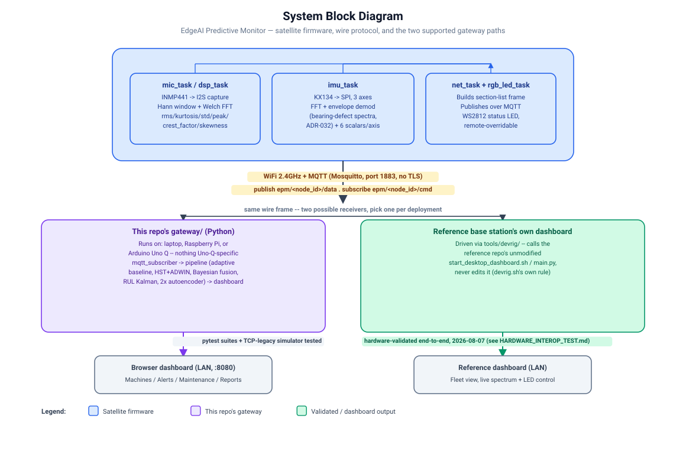
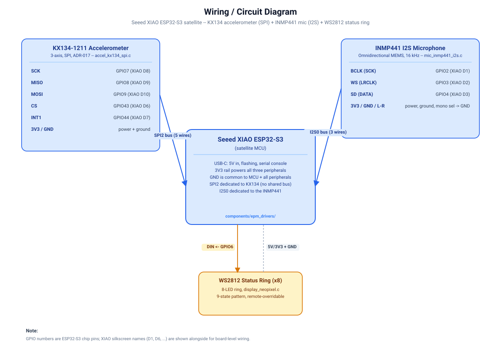

# EdgeAI Predictive Monitor — Satellite Node

A wireless multi-satellite bearing-fault detection system for industrial motors.
XIAO ESP32-S3 sensor nodes stream real-time FFT + scalar telemetry over MQTT to
an Arduino Uno Q base station (the reference `edgeai-predictive-monitor` gateway) that
applies statistical + ML anomaly detection, classifies fault types, logs sensor
data, and serves a live web dashboard accessible from any device on the LAN.

> **Wire protocol:** [`docs/BASE_STATION_CONTRACT.md`](docs/BASE_STATION_CONTRACT.md)
> is the accurate, currently-maintained source for the MQTT topics and frame
> format below — verify against it (or the code) if anything here drifts.

---

## System Architecture

```
┌────────────────────────────────────────────────────────────────┐
│  XIAO ESP32-S3  (satellite sensor node)  ×N                    │
│                                                                │
│  INMP441 mic ─► I2S ─► spectrum FFT                            │
│  KX134 IMU   ─► SPI ─► spectrum FFT ×3 axes (X/Y/Z)            │
│                              ↓ section-list telemetry frame     │
│  rgb_led_task ◄── STATUS_LED cmd ◄────────────────────────     │
└────────────────────────────────────────────────────────────────┘
                    WiFi 2.4 GHz / MQTT (Mosquitto, port 1883)
       publish: epm/<node_id>/data     subscribe: epm/<node_id>/cmd
┌────────────────────────────────────────────────────────────────┐
│  Arduino Uno Q 4GB  — ABX00173  (permanent AI gateway)         │
│                                                                │
│  MPU: Qualcomm Dragonwing QRB2210                              │
│       Quad-core ARM Cortex-A53 @ 2.0 GHz                      │
│       4 GB LPDDR4 RAM  ·  16 GB eMMC  ·  Debian Linux         │
│       Adreno 702 GPU  ·  OpenCL 2.0 / NEON SIMD inference      │
│       Wi-Fi 5 (2.4 / 5 GHz)  ·  BT 5.1                        │
│                                                                │
│  MCU: STM32U585  ARM Cortex-M33 @ 160 MHz  (real-time I/O)    │
│                                                                │
│  gateway/  (Python, runs on MPU / Linux side)                  │
│   ├─ mqtt_subscriber.py — subscribes epm/+/data, decodes frame │
│   ├─ 30-frame adaptive Z-score baseline per satellite          │
│   ├─ Kurtosis + crest factor + high-band energy scoring        │
│   ├─ HalfSpaceTrees online anomaly detection + Bayesian fusion │
│   ├─ CSV log  →  logs/  (per satellite per day)                │
│   ├─ Maintenance log  →  logs/maintenance_log.json             │
│   ├─ Web dashboard  http://<uno-q-ip>:8080/  (PWA)            │
│   └─ STATUS_LED command reply via epm/<node_id>/cmd            │
└────────────────────────────────────────────────────────────────┘
                           LAN — HTTP port 8080
┌────────────────────────────────────────────────────────────────┐
│  Any browser on LAN  (phone / tablet / laptop)                 │
│   http://<uno-q-ip>:8080/           live dashboard             │
│   http://<uno-q-ip>:8080/api/report  printable PDF report      │
└────────────────────────────────────────────────────────────────┘
```

**This diagram shows the Arduino Uno Q variant of the gateway; a laptop-hosted
gateway runs the identical `gateway/` software minus the STM32 MCU/real-time-I/O
row.** Both are supported deployment targets — see
[Quick Start — Gateway](#quick-start--gateway) for which path has actually been
validated against real satellite hardware so far.

A generated block diagram of the same architecture:



> **Legacy dev-testing path:** the earlier raw-TCP + AES-128-GCM protocol
> (port 5100) is no longer spoken by the firmware in production — MQTT
> replaced it (see `docs/decisions/ADR-011-mqtt-transport-added.md` and
> `docs/decisions/ADR-023-transport-adrs-superseded.md`). It survives only as
> a local no-broker-needed dev tool: `tools/satellite_sim.py` still speaks it
> against `gateway/ingestion/tcp_legacy.py` (`docs/decisions/ADR-028`). Don't
> use it as a reference for what real hardware speaks to the reference base station.

---

## Hardware

| Component | Specs | Role |
|-----------|-------|------|
| Seeed XIAO ESP32-S3 | Dual-core LX7 @ 160 MHz, 8 MB Flash, 2 MB PSRAM | Satellite sensor node — capture, FFT, stream |
| INMP441 / ICS-43434 | I2S MEMS, −26 dBFS sensitivity, 60 Hz – 15 kHz | Acoustic bearing fault microphone |
| KX134 3-axis IMU | SPI, ±8g / ±16g / ±32g / ±64g, up to 25.6 kHz ODR | Vibration accelerometer — bolt to motor |
| **Arduino Uno Q 4GB** | QRB2210 quad A53 @ 2.0 GHz, **4 GB LPDDR4**, 16 GB eMMC, Adreno 702 GPU (OpenCL 2.0), Wi-Fi 5 | AI gateway + dashboard server |
| 2.4 GHz AP / hotspot | Windows / Android / iPhone hotspot all work | WiFi network for satellite connections |

### Arduino Uno Q 4GB — Full Specification

The gateway runs on the **MPU side** (Linux / Debian). The STM32 MCU side handles real-time I/O and is not used by this project.

| Attribute | Value |
|-----------|-------|
| Model | ABX00173 |
| MPU | Qualcomm Dragonwing QRB2210 |
| CPU cores | 4× ARM Cortex-A53 @ 2.0 GHz |
| RAM | **4 GB LPDDR4** |
| Storage | 16 GB eMMC (expandable via USB) |
| GPU | Adreno 702 @ 845 MHz, OpenCL 2.0 — optional TVM/OpenCL acceleration |
| OS | Debian Linux (upstream kernel) |
| WiFi | Wi-Fi 5 (802.11ac) 2.4 GHz + 5 GHz, onboard antenna |
| Bluetooth | BT 5.1, onboard antenna |
| MCU (co-processor) | STM32U585 ARM Cortex-M33 @ 160 MHz, 2 MB flash, 786 KB SRAM |
| USB | USB-C with host/device switching and video output |
| Container support | Docker + Docker Compose pre-installed |
| AI framework | Arduino App Lab — one-click model deployment, OTA updates |
| Power | USB-C 5V 3A or VIN 7–24 V |
| Form factor | 68.85 × 53.34 mm (standard UNO) |

**Why the 4 GB variant matters for this project:**
- Runs full IsolationForest ML training on-device — no laptop needed for model updates
- Holds 200-frame history per satellite in RAM without pressure (16+ satellites simultaneously)
- Enough headroom to run larger neural network models (TFLite / ONNX) in future
- 16 GB eMMC stores years of daily CSV sensor logs without SD card

> **Microphone note:** The firmware uses the standard I2S driver targeting
> **external** microphones (INMP441, ICS-43434) wired to GPIO 2/3/4.  
> The XIAO ESP32-S3 Sense board's onboard PDM microphone needs a different driver
> (`i2s_pdm_rx_config_t`).  To use the onboard mic, swap
> `i2s_channel_init_std_mode` for `i2s_channel_init_pdm_rx_mode` in
> `components/epm_drivers/mic_inmp441_i2s.c` — the comment at the top of that file
> explains exactly what to change.

### Wiring — XIAO ESP32-S3 ↔ INMP441

| XIAO pin | GPIO | INMP441 pin |
|----------|------|-------------|
| D1       | 2    | SCK (BCLK)  |
| D2       | 3    | WS (LRCLK)  |
| D3       | 4    | SD (data out from mic) |
| 3V3      | —    | VDD + L/R pin → GND (selects left channel) |
| GND      | —    | GND         |

Pin assignments are in `components/epm_drivers/include/drivers/mic_inmp441_i2s.h`
and the full pin map (including the KX134 SPI IMU) is in
[`docs/hardware/PIN_ALLOCATION.md`](docs/hardware/PIN_ALLOCATION.md).

### Wiring — XIAO ESP32-S3 ↔ KX134 (SPI)

| GPIO | KX134 pin | Function |
|------|-----------|----------|
| 7    | SCLK      | SPI clock (10 MHz) |
| 8    | MISO/SDO  | SPI data in (acceleration reads) |
| 9    | MOSI/SDI  | SPI data out (command/config writes) |
| 43   | CS        | Chip select, active LOW (`KX134_PIN_CS`) |
| 44   | INT1      | Interrupt 1 — wired but not currently read by firmware (`KX134_PIN_INT1`) |
| 3V3  | VDD       | Power |
| GND  | GND       | Ground |



GPIO43/44 double as UART0 TX/RX on this board, but that's safe here since the
debug console runs over USB-JTAG (`esp-builtin`) rather than physical UART0
pins. Full rationale and the rest of the pin map:
[`docs/hardware/PIN_ALLOCATION.md`](docs/hardware/PIN_ALLOCATION.md).

---

## Repository Layout

```
edgeai-predictive-monitor-satellite/
├── src/
│   ├── main.c                   # app_main — FFT table init, task start (boot order in file header)
│   └── threads/
│       ├── mic_task.c/h         # I2S capture, windowed FFT, time-domain stats
│       ├── dsp_task.c/h         # mic spectrum compute (Welch overlap, centroid)
│       ├── imu_task.c/h         # KX134 3-axis spectrum compute
│       ├── net_task.c/h         # builds + publishes the MQTT telemetry frame
│       ├── led_task.c/h         # thin wrapper around the epm_hal display driver
│       ├── wifi_task.c/h        # WiFi STA event-driven bring-up (no task of its own)
│       └── wifi_provision_task.c/h  # captive-portal provisioning state machine
│   ├── epm_config.h             # Compile-time tunables: FFT sizes, task stacks, GPIO pins
│   └── CMakeLists.txt
│
├── components/
│   ├── epm_codec/           # Wire-format codec (section-list telemetry frame, MQTT cmd envelope)
│   ├── epm_drivers/         # link_mqtt.c, mic_inmp441_i2s.c, accel_kx134_spi.c,
│   │                        # display_ledc.c / display_neopixel.c, provisioning (AP + captive portal)
│   ├── epm_dsp/              # FFT window, spectrum, scalar stats, envelope analysis
│   └── epm_hal/              # HAL interfaces (hal_transport, hal_display, hal_accel, hal_provisioning)
│
├── tools/
│   └── satellite_sim.py     # Legacy TCP+AES dev simulator — see ADR-028, not the MQTT wire path
│
├── gateway/                  # The Python base-station-side gateway
│   ├── main.py               # entry point / argument wiring
│   ├── ingestion/            # mqtt_subscriber.py (production), tcp_legacy.py (dev/test only)
│   ├── pipeline/             # baselines, HST online detector, Bayesian fusion, RUL, ML scoring
│   ├── registry/             # per-satellite state + baseline persistence
│   ├── api/                  # dashboard.py, live_plot.py, reports.py, notifications.py
│   └── common/                # telemetry_frame.py / wire_protocol.py (Python mirror of the C codec)
│
├── mic_tools/
│   ├── recv_verify.py          # Legacy monolith — being absorbed into gateway/, still the CLI entry
│   ├── bearing_math.py         # ISO bearing fault frequencies — BPFO/BPFI/BSF/FTF
│   ├── ml_trainer.py           # Train IsolationForest anomaly model from CSV logs
│   ├── mic_char_analyze.py     # Microphone characterization tooling
│   ├── Dockerfile              # Docker deployment for Arduino Uno Q (pre-installed on Uno Q)
│   └── requirements.txt
│
├── schema/
│   └── telemetry_schema.json   # Source of truth for section/channel/scalar ids — generates
│                                # components/epm_codec/include/frame_codec/telemetry_schema.h
│
├── docs/
│   ├── BASE_STATION_CONTRACT.md  # Current, verified MQTT wire-contract reference
│   ├── CONVENTIONS.md            # Naming/error-handling/commit conventions
│   ├── decisions/                # Numbered ADRs, append-only
│   └── hardware/PIN_ALLOCATION.md
│
├── tests/
│   ├── host/                # C unit tests (DSP, codec, scalar stats) — CMake + CTest
│   ├── pipeline/, ingestion/, registry/, common/   # Python pytest suites
│
├── CMakeLists.txt          # Root ESP-IDF project
├── platformio.ini          # PlatformIO build + upload config
├── sdkconfig.defaults      # ESP-IDF KConfig overrides (watchdog, TCP buffers, -O2)
└── .gitignore
```

---

## Quick Start — Satellite Firmware

> Bringing up a brand-new node from a bare XIAO ESP32-S3 + INMP441 + KX134?
> [`docs/NEW_NODE_SETUP_GUIDE.md`](docs/NEW_NODE_SETUP_GUIDE.md) walks the
> whole thing end-to-end — wiring, build, provisioning, flashing, and
> debugging — in one place.

### 1. Prerequisites

- [PlatformIO](https://platformio.org/) with the Espressif32 platform installed, **or**
  ESP-IDF v5.x (`idf.py` in PATH)
- Python 3.9+ (on the dev laptop, for flashing only)

### 2. Provision WiFi + MQTT broker (captive portal — no source edits needed)

There is no compile-time credentials file anymore. On first boot (or whenever
no WiFi credentials are saved in NVS), the satellite brings up its own AP,
`EPM-SAT-<node_id>`, alongside a captive portal:

1. Connect a phone/laptop to `EPM-SAT-<node_id>`. The AP's WPA2 password is
   generated once on-device (`components/epm_drivers/ap_credentials.c`) and
   printed to the serial console at first boot — write it down.
2. The OS should auto-open the captive-portal form (DNS wildcard responder,
   `components/epm_drivers/dns_captive.c`); if not, browse to `192.168.4.1`.
3. Submit: WiFi SSID, WiFi password, **MQTT Broker Host** (the Uno Q's LAN
   IP or hostname running Mosquitto), and **MQTT Broker Port** (default
   `1883`). Credentials persist in NVS (`components/epm_drivers/net_credentials.c`)
   and survive reboots/reflashes.

For a dev-bench default without touching the portal each time, seed a
first-boot default via `-DEPM_MQTT_BROKER_HOST=\"...\"` build flags, read by
`components/epm_drivers/link_mqtt.c`'s `#ifndef`-guarded default
(`"10.42.0.1"`) — but any value submitted through the portal always wins once
saved. Rather than exporting `PLATFORMIO_BUILD_FLAGS` by hand each time the
bench network changes, copy `.env.local.example` to `.env.local` (gitignored)
and build/flash through `pio.sh`/`pio.ps1` instead of `pio` directly — they
read `.env.local` and pass the override through automatically, the same
`.env.local` pattern `tools/devrig/` uses for its reference-repo URL. See
`docs/decisions/ADR-031-provisioning-ap-random-per-device-password.md`
and `docs/PHASE_12A_PROMPT.md`/`docs/PHASE_12B_PROMPT.md` for the full design.

### 3. Build and Flash

**PlatformIO (recommended):**
```bash
pio run --target upload --environment xiao_esp32s3
pio device monitor
```

**ESP-IDF directly:**
```bash
idf.py -p COM9 flash monitor    # adjust port for your system
```

---

## Quick Start — Gateway

The gateway is a standard Python 3.9+ package. The setup below runs identically
on a laptop, a Raspberry Pi, or an Arduino Uno Q base station — nothing in it
is Uno-Q-specific except where noted.

> **What's actually been hardware-tested:** A laptop + `tools/devrig/`, driving
> the **reference repository's own dashboard/classifier** against real XIAO
> satellite firmware, has soaked the wire protocol multiple times — most
> recently 2026-08-11 (14m16s, 2091 messages, ~4.75 msg/s), which re-verified
> that ADR-040's 256-bin spectra and ADR-032's 3 envelope channels are still
> wire-compatible with the reference base station's own *unmodified* code —
> zero changes needed on that side (`input_dim` auto-sized 536→1048). That
> same session also live-reproduced and root-caused the recurring "blue
> breathing" LED drops as a **silent MQTT-layer stall** (data frozen for
> ~400-450s, then self-recovers via the ADR-036 watchdog — WiFi itself never
> drops). Full detail: `docs/performance/HARDWARE_INTEROP_TEST.md`.
>
> On classification accuracy specifically
> (`tools/accuracy_harness/PHASE_B_REPORT.md`), across all 7 possible
> classifier outputs:
>
> - **Normal** and **Bearing Fault** are real-hardware confirmed — 135,032
>   ambient frames correctly read as Normal, and a real mic capture correctly
>   classified "Bearing Fault — Early".
> - **Mechanical Imbalance**, **Shaft Misalignment**, and **Mechanical
>   Looseness** were each attempted on real hardware and did not trigger —
>   not unexplored gaps, but honestly characterized negative results with the
>   blocking mechanism identified for each (e.g. Misalignment's real
>   `imu_crest` maxed at 5.6-5.9 against the 9.0 gate it needs; Looseness's
>   `hi_r` improved from a ~0.46 to a ~0.30 mean after the 256-bin change
>   (ADR-040) but still didn't clear its gate on any burst frame).
> - The fallback labels **Severe Anomaly — Inspect** and **Elevated
>   Vibration** are also real-hardware confirmed reachable.
>
> This repo's own `gateway/` package is covered by its pytest suites and
> `tools/satellite_sim.py`'s legacy TCP simulator for everything above. See
> `tools/devrig/README.md` to reproduce the hardware-validated path (WSL + a
> sibling read-only clone of the reference repo; `tools\devrig\devrig.ps1
> --nodes 1 --port 8180 --captures-dir "" --auto-online` from PowerShell).

### 1. First-time setup

```bash
# Update packages
sudo apt update && sudo apt upgrade -y

# Install Python (already on Debian/Ubuntu, but ensure pip is available)
sudo apt install python3 python3-pip python3-venv git -y

# Clone the repo
git clone https://github.com/Abhinavkrishna3211/edgeai-predictive-monitor-satellite.git
cd edgeai-predictive-monitor-satellite/mic_tools

# Create a virtual environment (keeps the system Python clean)
python3 -m venv venv
source venv/bin/activate

# Install dependencies
pip3 install -r requirements.txt
```

### 2. Start Mosquitto (the MQTT broker satellites publish to)

```bash
sudo apt install mosquitto -y
sudo systemctl enable --now mosquitto
```

The satellite firmware's captive-portal provisioning (Quick Start — Satellite
Firmware, step 2) needs this broker's LAN IP/hostname and port (default `1883`).

### 3. Start the gateway

`--mqtt-host` turns on live MQTT ingestion (`gateway/ingestion/mqtt_subscriber.py`,
subscribing `epm/+/data`), routing into the same per-frame pipeline
(`recv_verify._process_satellite_frame()`) as the legacy TCP path; omit it and
only `tools/satellite_sim.py` will feed the pipeline.

```bash
# Activate venv first (if not already active)
source venv/bin/activate

# Minimal headless startup, ingesting from the local Mosquitto broker
python3 recv_verify.py --no-plot --mqtt-host localhost

# Production startup with auth, factory label, and notifications
python3 recv_verify.py --no-plot --mqtt-host localhost \
    --factory-name "Plant A — Line 3" \
    --auth admin:yourpassword \
    --notify-webhook "https://hooks.slack.com/services/..."

# With email alerts (SMTP)
python3 recv_verify.py --no-plot \
    --notify-email "from@gmail.com:to@gmail.com:smtp.gmail.com:587:user@gmail.com:apppassword"

# With ML anomaly model (train first, see ML section below)
python3 recv_verify.py --no-plot --model model/epm_model

# With bearing fault frequency markers (if shaft speed is known)
python3 recv_verify.py --no-plot --shaft-rpm 1500 --bearing 6205
```

`User`/`WorkingDirectory` below assume an Uno Q's default `arduino` user —
adjust for whatever account runs the gateway on your machine.

### 4a. Run as systemd service (auto-start on boot)

```ini
# /etc/systemd/system/epm-gateway.service
[Unit]
Description=EPM Predictive Maintenance Gateway
After=network-online.target mosquitto.service
Wants=network-online.target

[Service]
Type=simple
User=arduino
WorkingDirectory=/home/arduino/edgeai-predictive-monitor-satellite/mic_tools
ExecStart=/home/arduino/edgeai-predictive-monitor-satellite/mic_tools/venv/bin/python3 \
    recv_verify.py \
    --no-plot \
    --mqtt-host localhost \
    --factory-name "Plant A" \
    --auth admin:yourpassword
Restart=always
RestartSec=5

[Install]
WantedBy=multi-user.target
```

```bash
sudo systemctl daemon-reload
sudo systemctl enable epm-gateway
sudo systemctl start epm-gateway
sudo systemctl status epm-gateway    # verify it started
journalctl -u epm-gateway -f         # live log output
```

### 4b. Run via Docker (alternative — cleanest deployment)

```bash
cd mic_tools

# Build the image once
docker build -t epm-gateway .

# Run (--network host gives the container direct access to the LAN)
docker run -d --name epm \
    --network host \
    --restart unless-stopped \
    -v $(pwd)/logs:/app/logs \
    -v $(pwd)/model:/app/model \
    -e FACTORY_NAME="Plant A — Line 3" \
    -e AUTH="admin:yourpassword" \
    -e NOTIFY_WEBHOOK="https://hooks.slack.com/services/..." \
    epm-gateway

# View live gateway output
docker logs -f epm

# Stop
docker stop epm
```

Logs and ML models are stored on the host machine (mounted volumes) so they survive container restarts.
`--network host` is what lets the container reach the host's Mosquitto broker at `localhost:1883`.

### 5. Find the gateway machine's IP address

```bash
ip a show wlan0       # if connected via WiFi
ip a show eth0        # if connected via Ethernet (USB-C adapter)
hostname -I           # shows all IPs
```

### 6. Open the dashboard

```
http://<gateway-ip>:8080/
```

Open from any phone, tablet, or laptop on the same WiFi network. No software
to install on the viewing device — it's just a browser. On Android: tap
browser menu → **Add to Home Screen** to install as a PWA app icon.

### If you have the Arduino Uno Q 4GB reference hardware

Everything above runs unmodified on the Uno Q's Linux (MPU) side — headless,
no display, no laptop needed after first setup. See [Hardware](#hardware)
below for its full spec and why the 4 GB RAM variant matters for on-device
training.

---

## Web Dashboard

The dashboard is a full industrial monitoring interface served by the gateway.
Access it from **any browser on the LAN** — phones, tablets, laptops.

### Tabs

| Tab | Contents |
|-----|----------|
| **Machines** | Live machine cards: health bar, kurtosis, crest factor, RMS, z-score, FPS, RUL estimate, sparkline chart, maintenance date |
| **Alert Log** | Full compliance-ready audit trail of every state transition (OK→WARN→FAULT→OK) with timestamps |
| **Maintenance** | Per-machine maintenance records; log a new service entry via modal form |
| **Reports** | System overview, compliance checklist, per-machine report links |

### Machine card actions

Each machine card has three buttons:
- **Log Maintenance** — opens a form to record a service visit (technician, type, date, notes)
- **Report** — opens a printable HTML inspection report for that machine in a new tab
- **CSV** — downloads the latest sensor data as a spreadsheet

### Printable HTML reports

Navigate to **Reports → Full Factory Report** or click **Report** on any machine card.

The report opens in your browser with:
- Cover page (factory name, date, report scope)
- Executive summary (risk level, 6 KPI tiles)
- Machine status table (one row per satellite)
- Per-machine detail: metrics, health bar, session analysis (fault/warn rates, trend), last 12 alert events, maintenance record, recommendations
- Full alert audit trail (all events, numbered and timestamped)
- Maintenance log summary with overdue detection
- 7-point compliance checklist

To save as PDF: `Ctrl+P` → **Save as PDF**.  
The `@media print` CSS removes navigation elements automatically for a clean A4 layout.

### HTTP Basic Auth

Start the gateway with `--auth USER:PASS` to require login before the dashboard loads.
The browser caches credentials for the session — one login per browser.

### Emergency notifications

- **Webhook** (`--notify-webhook URL`): posts a JSON alert card to Discord, Slack, or Microsoft Teams when any satellite enters FAULT state. Rate-limited to one notification per satellite per 5 minutes.
- **Email** (`--notify-email FROM:TO:HOST:PORT:USER:PASS`): sends an SMTP email alert. Works with Gmail (app password), Outlook, or any SMTP relay.

---

## Testing Without Hardware — Satellite Simulator

`tools/satellite_sim.py` speaks the **legacy TCP+AES protocol**
(`docs/decisions/ADR-028`), not MQTT — it exercises the gateway's full
alerting/HST/fusion/CSV pipeline without needing real firmware or a running
Mosquitto broker. It is not representative of what real hardware sends the
reference base station; use it purely for local gateway development.

```bash
# Terminal 1: start gateway (from the repo root) — TCP legacy listener is always on
python3 mic_tools/recv_verify.py --no-plot

# Terminal 2: simulate 3 healthy satellites (also from the repo root)
python3 tools/satellite_sim.py 127.0.0.1 5100 3

# Inject fault conditions — test alert logic and LED patterns
python3 tools/satellite_sim.py 127.0.0.1 5100 5 --fault 1 --warn 2
```

Each simulated satellite has a unique fake MAC, sends realistic FFT data, and
auto-reconnects if the gateway restarts.

---

## Bearing Fault Analysis

`bearing_math.py` computes ISO standard bearing defect frequencies from geometry
and shaft speed.

```bash
# Print BPFO / BPFI / BSF / FTF for bearing 6205 at 1500 RPM
python3 bearing_math.py 6205 1500

# List all 18 built-in bearing geometries (6200-6210, 6304-6310)
python3 bearing_math.py 6205 1500 --list

# Custom geometry: n=9 balls, D=38.5 mm pitch, d=10.3 mm ball
python3 bearing_math.py 9,38.5,10.3 1500
```

Run with the gateway to add colored fault frequency markers on FFT plots:

```bash
python3 recv_verify.py --shaft-rpm 1500 --bearing 6205
```

| Marker | Color | Fault type |
|--------|-------|------------|
| `BPFO` | Red | Outer race defect |
| `2×BPFO` | Pink | Outer race 2nd harmonic |
| `BPFI` | Orange | Inner race defect |
| `2×BPFI` | Amber | Inner race 2nd harmonic |
| `BSF` | Purple | Ball spin defect |
| `FTF` | Cyan | Cage fundamental |
| `shaft` | Yellow | Shaft 1× (imbalance reference) |

---

## ML Training Pipeline

The gateway machine — a laptop or an Arduino Uno Q 4GB — has more than enough
compute to run all training steps directly, no separate training machine needed.

### 1. Collect training data

Run the gateway for at least 30 minutes of normal healthy motor operation.
Each satellite logs to `logs/epm_<name>_<YYYYMMDD>.csv` automatically.

### 2. Train on the gateway machine

```bash
# Activate venv on whatever machine ran the gateway (SSH in first if it's a
# remote Uno Q; run locally if it's your laptop)
source ~/edgeai-predictive-monitor-satellite/mic_tools/venv/bin/activate
cd ~/edgeai-predictive-monitor-satellite/mic_tools

python3 ml_trainer.py                           # train on all satellites
python3 ml_trainer.py --satellite SAT-A3B4      # one satellite only
python3 ml_trainer.py --contamination 0.03 --n-estimators 300
```

Writes `model/epm_model_iso.joblib` and `model/epm_model_meta.json`.
Training on typical log sizes (100K+ rows) completes in under 30 seconds on the
Uno Q's quad-core A53 — faster still on most laptops.

### 3. Activate the model

```bash
# If using systemd, edit the service ExecStart to add --model, then:
sudo systemctl restart epm-gateway

# Or restart manually:
python3 recv_verify.py --no-plot --model model/epm_model
```

The ML model runs alongside the statistical detector — the more severe alert wins.
Inference activates only after each satellite's 30-frame baseline is established.

### 4. Offline analysis

```bash
python3 ml_infer.py                        # compare ML vs threshold alerts
python3 ml_infer.py --top-anomalies 20     # 20 worst frames across all satellites
python3 ml_infer.py --export report.csv    # export per-frame predictions
```

---

## Neural Inference

EdgeAI Predictive Monitor uses ONNX Runtime, which auto-selects ARMv8 NEON SIMD
on aarch64 hosts (including the Uno Q's Cortex-A53 cores) or AVX2 on x86
laptops — the same 7-dim statistical-feature autoencoder runs portably either
way. On the Uno Q specifically, optional OpenCL acceleration on the Adreno 702
GPU is available via Apache TVM (see [docs/GPU_SETUP.md](docs/GPU_SETUP.md) for
build instructions) — it currently accelerates this same model, not a separate
one. Both paths are fully open-source — no Qualcomm proprietary SDK required.

> EPM uses only MIT- and Apache 2.0-licensed tooling that can be audited,
> redistributed, and deployed without any vendor agreement or proprietary SDK.

### Provider selection

`gateway/pipeline/inference.py` automatically picks the best available backend:

| Priority | Provider | Hardware |
|----------|----------|----------|
| 1 | `CUDAExecutionProvider` | NVIDIA dev laptops |
| 2 | `CoreMLExecutionProvider` | macOS dev laptops |
| 3 | `CPUExecutionProvider` | aarch64 hosts incl. Uno Q (NEON), x86 laptops (AVX2) |

The `CPUExecutionProvider` on aarch64 hosts like the Uno Q is NEON-accelerated
automatically by ONNX Runtime's aarch64 build — no configuration needed. The
7-feature autoencoder hits ~1–3 ms on the Uno Q's A53 cores, which is already
faster than the satellite frame rate (~450 ms/frame).

### Benchmark

```bash
# Run after installing onnxruntime:
python3 gateway/pipeline/inference.py --model model/autoencoder.onnx

# Expected output:
# [EPM] Inference backend: ONNX Runtime / CPUExecutionProvider (NEON aarch64)
# [EPM] Model: autoencoder_v1 (7-dim input, 8-dim bottleneck)
# [EPM] Latency: p50=1.8ms p95=2.4ms p99=2.9ms (n=200)
# [EPM] Throughput: 555 inferences/sec, headroom for 200 satellites @ 2 fps each
```

### Optional Adreno 702 GPU path

GPU inference via Apache TVM + OpenCL on the Uno Q's Adreno 702 can reduce
latency on this same model by 2–4×. See [docs/GPU_SETUP.md](docs/GPU_SETUP.md).
A larger Conv1D autoencoder on raw FFT input is a reserved/aspirational target
for this path, not something implemented today.

```bash
# Verify OpenCL first, then:
python3 gateway/pipeline/inference_gpu.py --model model/autoencoder.onnx
```

`inference_gpu.py` exposes the same interface as `inference.py` and falls back to
the CPU path automatically if TVM is not installed.

---

## Battery Efficiency on XIAO

The firmware calls `esp_wifi_set_ps(WIFI_PS_NONE)` — full power, best throughput.
Typical draw ~80–200 mA at 3.3 V on active WiFi.

| Change | Location | Effect |
|--------|----------|--------|
| `WIFI_PS_MIN_MODEM` | `wifi_task.c` | ~30% lower WiFi power, ≤100 ms extra latency |
| `FFT_MIC_N=512` | `platformio.ini` build_flags | Shorter compute → shorter radio-on time |
| `SPEC_AVG_N=8` | `platformio.ini` build_flags | Longer inter-frame sleep → lower duty cycle |
| Deep-sleep burst | Requires wifi_task rework | Lowest power; loses continuous streaming |

For USB-powered or panel-mounted installs the current setting is optimal.
For LiPo field use, switch to `WIFI_PS_MIN_MODEM`.

---

## LED Indicator

8-pixel WS2812 (NeoPixel) ring on GPIO6, driven via `led_strip` (RMT-backed) —
`components/epm_drivers/display_neopixel.c`. All pixels always show the same
color/pattern. `display_ledc.c` (a plain 3-channel monochrome LEDC driver on
GPIO1/5/6) exists as a Kconfig fallback (`EPM_DISPLAY_USE_LEDC`) but is not
the default build.

Color/mode/period match the reference base station's own `status_color.py`
exactly for every state that has an equivalent there, so LED meaning is
identical on both sides of the wire (`docs/decisions/ADR-016-*.md`).

| State | Color | Mode | Period | Meaning |
|-------|-------|------|--------|---------|
| `RGB_BOOT` | White `#FFFFFF` | Solid | — | Power-on, initialising |
| `RGB_WIFI_CONN` | Blue `#0000FF` | Breathe | 1200 ms | Connecting to WiFi |
| `RGB_TCP_CONN` | Blue `#0000FF` | Strobe | 300 ms | WiFi up, connecting to broker |
| `RGB_CALIBRATING` | Cyan `#22D3EE` | Solid | — | Collecting baseline frames |
| `RGB_LEARNING` | Cyan `#22D3EE` | Solid | — | Training baseline (same color as CALIBRATING — reference has one "commissioning" state, not two) |
| `RGB_OK` | Green `#00FF00` | Solid | — | Healthy, normal vibration |
| `RGB_WARN` | Amber `#F59E0B` | Breathe | 1500 ms | Elevated evidence (kurtosis/RMS/fusion) |
| `RGB_FAULT` | Red `#FF0000` | Strobe | 200 ms | Fault detected — inspect now |
| `RGB_TRIPPED` | Red `#FF0000` | Strobe | 1000 ms | Machinery-protection trip (remote-driven, slower strobe than FAULT) |

Breathe = cosine brightness ramp; Strobe = 50/50 on/off square wave. A remote
`STATUS_LED` MQTT command can override any local state with an arbitrary
`(rgb, mode, period_ms)` triple — see [Wire Protocol](#wire-protocol).

---

## Wire Protocol

Full detail lives in [`docs/BASE_STATION_CONTRACT.md`](docs/BASE_STATION_CONTRACT.md) — this
section is a summary. All multi-byte fields are **little-endian**.

Transport is MQTT to Mosquitto on the base station (port 1883, no TLS on the local
network). Each satellite publishes to `epm/<node_id>/data` (QoS 0) and subscribes to
`epm/<node_id>/cmd` (QoS 1), where `node_id` is the last 6 hex characters of the
satellite's WiFi STA MAC.

### Data frame — section-list format

A frame is a header byte followed by a variable number of self-describing sections
(`components/epm_codec/spectrum_codec.c`):

```
[num_sections u8]
  repeated num_sections times:
  [source_id u8][channel_id u8][data_kind u8][section_len u16][body...]
```

`source_id` is `1` (satellite). `data_kind` is either `SPECTRUM` or `SCALAR_SET`:

```
SPECTRUM body:    [fs f32][fft_size u16][bin_count u16][bins f32...]
SCALAR_SET body:  [count u8][ids u16...][values f32...]
```

A satellite publishes one `mic` spectrum section (`channel_id=0`), three
`accel_x`/`accel_y`/`accel_z` spectrum sections (`channel_id=6/7/8`), and three
`accel_x/y/z_envelope` spectrum sections (`channel_id=9/10/11`,
amplitude-demodulated bearing-impact spectra — `components/epm_dsp/envelope.c`,
ADR-032) — each of these four channel groups followed by its own `SCALAR_SET`
section on `channel_id=255` carrying all six defined scalars: `rms`/
`kurtosis`/`crest_factor`/`peak`/`std`/`skewness`. The schema
(`schema/telemetry_schema.json`) also defines raw time-series debug channels
(`channel_id=2-5`) and a legacy combined `accel` channel (`channel_id=1`) —
neither is emitted by this firmware today.

### Command envelope — base station → satellite (`epm/<node_id>/cmd`)

```
[TYPE u8][PAYLOAD...]
```

Only one command type is currently handled:

| TYPE | Name | Payload |
|------|------|---------|
| `0x08` | `STATUS_LED` | `struct { uint32_t rgb; uint8_t mode; uint16_t period_ms; } __attribute__((packed))` |

Unrecognized TYPE bytes are ignored, so future command types (e.g. the
reference base station also defines `0x09 MOTOR_STOP` for a
machinery-protection feature this firmware doesn't implement) are safe to
receive.

---

## Alert Thresholds

Configured at the top of `mic_tools/recv_verify.py`. These drive the
OK → WARN → FAULT alert engine (`gateway/pipeline/alerting.py`'s
`compute_alert()`):

| Parameter | Default | Meaning |
|-----------|---------|---------|
| `CAL_FRAMES` | 30 | Frames to build z-score baseline |
| `K_WARN` | 6.0 | Kurtosis WARN (Gaussian noise ≈ 3) |
| `K_FAULT` | 12.0 | Kurtosis FAULT (advanced bearing damage) |
| `CREST_WARN` | 5.0 | Mic crest factor WARN |
| `CREST_FAULT` | 10.0 | Mic crest factor FAULT |
| `IMU_CREST_WARN` | 9.0 | Accelerometer crest factor WARN — a separate, higher threshold than the mic's, calibrated after real-hardware Part 3 testing found ambient IMU crest sits well above the mic's ambient baseline (`tools/accuracy_harness/PHASE_B_REPORT.md`) |
| `IMU_CREST_FAULT` | 18.0 | Accelerometer crest factor FAULT |
| `HIGH_BAND_MIN` | 0.12 | Min 2–8 kHz energy fraction to raise any alert |
| `WARN_PERSIST` | 2 | Consecutive above-threshold frames to raise WARN |
| `CLEAR_PERSIST` | 3 | Consecutive OK frames to clear WARN |
| `FAULT_CLEAR_PERSIST` | 8 | Consecutive OK frames to clear FAULT — longer than `CLEAR_PERSIST` so a confirmed fault can't clear on a couple of lucky-quiet frames |

`HIGH_BAND_MIN` prevents low-frequency factory floor rumble from triggering false
positives — bearing defects always excite the 2–8 kHz resonance band.

---

## Fault-Type Classification

Separately from the OK/WARN/FAULT alert engine above,
`gateway/pipeline/alerting.py`'s `_classify_fault_type()` labels every frame
with one of four physics-based fault types (or `Normal`), by pattern-matching
the same kurtosis/crest/band-ratio features against a per-fault-type gate.
This is the most validated and technically substantial part of the pipeline —
see [What's actually been hardware-tested](#quick-start--gateway) above and
`tools/accuracy_harness/PHASE_B_REPORT.md` for the real-hardware status of
every possible output.

A frame is labeled `Normal` only if mic kurtosis, mic crest, and IMU crest
are all below their WARN thresholds. Otherwise every gate below is evaluated,
and the frame gets whichever fault type clears its gate by the largest
relative margin (`_fault_candidate_scores()`). The order below only breaks an
exact tie between two equally-strong candidates — it is not evaluated
top-down:

| Fault type | Gate (`gateway/pipeline/alerting.py`) |
|---------------|----------------------------------------|
| Bearing Fault | `hi_r > 0.40` and `mic_kurtosis >= K_WARN` |
| Mechanical Imbalance | `mic_crest >= CREST_WARN` and `mic_kurtosis < K_WARN × 1.4` and `lo_r > 0.45` |
| Shaft Misalignment | `imu_crest >= IMU_CREST_WARN` and `mid_r > 0.35` and `mic_kurtosis < K_FAULT` |
| Mechanical Looseness | `mic_kurtosis >= K_WARN` and `hi_r < 0.30` and `lo_r < 0.55` and `mid_r > 0.20` |

(`hi_r`/`lo_r`/`mid_r` are the mic FFT's high/low/mid band energy fractions —
`_band_ratios()`.)

If no fault-type gate is satisfied, the frame falls through to a
kurtosis-magnitude label instead: `Severe Anomaly — Inspect`
(`mic_kurtosis >= K_FAULT`), `Elevated Vibration` (`mic_kurtosis >= K_WARN`),
or `Anomalous Vibration` (neither, but still not `Normal`).

### Bearing frequency corroboration (ADR-038)

When shaft speed and bearing geometry are supplied
(`--shaft-hz`/`--shaft-rpm --bearing`),
`gateway/pipeline/bearing_corroboration.py`'s `corroborate_bearing_fault()`
adds one more, purely additive check on top of an already-triggered
`Bearing Fault` label: it looks for the mic FFT's dominant peak within 2 FFT
bins of a computed BPFO/BPFI/BSF/FTF marker (`bearing_math.py`). It never
influences the label itself — it's out-of-band physics evidence attached to
a label the pattern-match gate above already produced.

---

## Troubleshooting

**LED stays solid ON:**
WiFi not connecting. If this is a first boot (no saved credentials), the device
should instead be running its own `EPM-SAT-<node_id>` AP — check the serial monitor
for the WPA2 password it printed. If credentials are saved but wrong, reset them by
re-entering provisioning (see `docs/decisions/ADR-031-*.md`) rather than editing a file.

**LED stuck on WiFi/broker connecting blink, satellite never reaches OK:**
`mqtt_host`/`mqtt_port` submitted during provisioning don't match where Mosquitto is
actually listening on the base station. Run `ip a` on the Uno Q to get its address,
confirm Mosquitto is running (`systemctl status mosquitto`), and re-provision if needed.

**No satellites in dashboard / gateway shows no connects:**
Firewall blocking the MQTT broker port (1883) or the dashboard's HTTP port (8080).
- Linux/Uno Q: `sudo ufw allow 1883 && sudo ufw allow 8080`
- Windows (dev only): run the `New-NetFirewallRule` command the gateway prints at startup (elevated PowerShell, once)

**`satellite_sim.py` prints "Connection refused":**
This only applies to the legacy TCP dev-simulator path. Start `recv_verify.py`
first, then the simulator — see [Testing Without Hardware](#testing-without-hardware--satellite-simulator).

**Dashboard shows login prompt:**
Enter the credentials from your `--auth USER:PASS` flag. The browser caches them.

**Report page is blank or errors:**
The report is generated from live in-memory data — at least one satellite must have
connected and sent frames. Open the Machines tab first to confirm a satellite is visible.

**`TG1WDT_SYS_RST` crash on boot:**
Mitigated by `sdkconfig.defaults` (`CONFIG_ESP_INT_WDT_TIMEOUT_MS=1200`).
If it recurs, verify that `wifi_rf_init()` is called before `imu_task_start()`
and `mic_task_start()` in `src/main.c` — that order is critical.

**Build error: `i2s_std.h: No such file`:**
PlatformIO platform is on ESP-IDF 4.x. Add to `platformio.ini`:
`platform = espressif32 @ ^6.0.0`

---

## Roadmap

- [x] MEMS microphone capture (I2S, 48 kHz, 1024-pt FFT)
- [x] Kurtosis, crest factor, high-band energy scoring — all six scalars now computed (`rms`/`kurtosis`/`crest_factor`/`peak`/`std`/`skewness`)
- [x] Adaptive per-machine baselines — Welford warm-up (30 frames) then continuous EMA tracking (`alpha=5e-05`, ~11.5 min half-life at 2 fps), updated only on healthy frames (`adaptive_baseline.py`)
- [x] MQTT streaming protocol (section-list telemetry frames; legacy binary TCP protocol kept for dev-only simulator use, `docs/decisions/ADR-028`)
- [x] Multi-satellite gateway with per-satellite CSV logging
- [x] 9-state WS2812/NeoPixel RGB LED indicator (`display_neopixel.c`), remote-overridable via `STATUS_LED` MQTT command
- [x] Multi-satellite simulator (`satellite_sim.py`)
- [x] ISO bearing fault frequency calculator — BPFO/BPFI/BSF/FTF (`bearing_math.py`)
- [x] IsolationForest ML anomaly model training (`ml_trainer.py`)
- [x] Offline ML inference and fleet anomaly report (`ml_infer.py`)
- [x] Remaining Useful Life (RUL) estimate — exponential-degradation 2-state Kalman filter (`rul_estimator.py`)
- [x] Bayesian multi-channel fusion — combines z-kurtosis/z-rms/z-HST (+ z-ae when `--autoencoder` is supplied) into a posterior P(fault | evidence) (`bayesian_fusion.py`)
- [x] ADWIN concept-drift detection — re-learns the online detector + baseline together on a detected regime change (`online_detector.py`)
- [x] ONNX Runtime inference with automatic CUDA / CoreML / NEON provider selection — 7-dim statistical-feature autoencoder trained by `mic_tools/train_autoencoder.py` (`inference.py`)
- [x] TFLite autoencoder pipeline — 41-dim stat+spectral-band feature vector targeting the Uno Q's Adreno GPU via a TFLite/QNN delegate (`gateway/pipeline/autoencoder.py`, wired through `ml_scoring.py`)
- [x] Optional Adreno 702 OpenCL GPU path via Apache TVM — no proprietary SDK (`inference_gpu.py`)
- [x] KX134 IMU real SPI DMA driver — default hardware path since ADR-017; the synthetic stub (`accel_stub.c`) is opt-in only under Kconfig `EPM_ACCEL_USE_STUB`
- [x] Envelope analysis on IMU data — amplitude demodulation of bearing impacts, published as `accel_x/y/z_envelope` spectrum channels (`components/epm_dsp/envelope.c`, ADR-032)
- [x] SQLite WAL persistence — alert events, maintenance log, adaptive baselines, RUL state (`storage.py`)
- [x] CSV log rotation — dated subdirectory tree, gzip files older than 90 days
- [x] Headless gateway mode for Uno Q / SSH (`--no-plot`)
- [x] Professional industrial web dashboard — dark theme, tabbed UI, live machine cards
- [x] Alert audit trail — compliance-ready log of every state transition
- [x] Maintenance log — per-machine service records, modal entry form, JSON persistence
- [x] HTTP Basic Auth on dashboard (`--auth USER:PASS`)
- [x] Emergency notifications — Discord/Slack/Teams webhook + SMTP email (`--notify-webhook`, `--notify-email`)
- [x] Printable HTML inspection reports — per-machine and factory-wide, PDF-ready
- [x] Factory-wide status overview — global risk level, 6 KPI summary tiles
- [ ] NTC thermistor ADC channel for motor temperature trending
- [ ] Deep-sleep burst mode for LiPo battery field deployment
- [ ] Offline Chart.js bundle (removes CDN dependency for air-gapped installs)

---

## Security Notes

- WiFi/MQTT credentials are provisioned over the air via the captive portal
  (`docs/decisions/ADR-031-*.md`) and persisted in NVS — there is no source file
  to gitignore. The provisioning AP's WPA2 password is random per device
  (`esp_fill_random()`), printed once to serial at boot.
- The firmware enforces `WIFI_AUTH_WPA2_PSK` only — WPA/TKIP is rejected because
  TKIP is cryptographically broken and trivially crackable.
- MQTT traffic between satellite and base station is unauthenticated, unencrypted
  plaintext on the local network (no TLS, no broker credentials) — acceptable for
  a trusted LAN, not for exposure beyond it.
- The gateway's web dashboard binds to `0.0.0.0:8080`. Use `--auth USER:PASS` in
  any deployment where the LAN is not fully trusted.
- Do not expose the dashboard (8080), Mosquitto (1883), or the legacy dev-simulator
  port (5100) to the public internet. Run behind a firewall or VPN for remote access.
