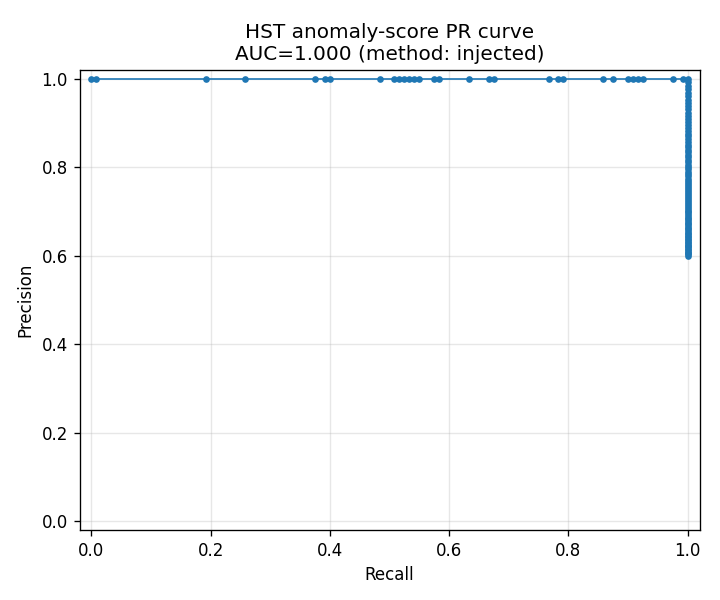
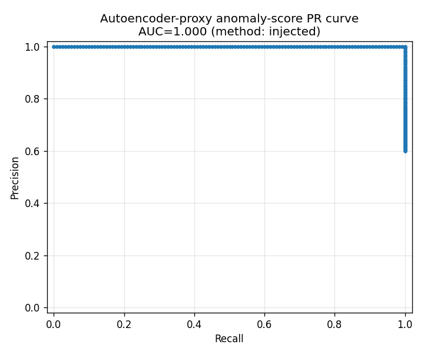

# Anomaly-score evaluation — method: injected

Healthy: 300 training + 80 held-out test samples (jittered Normal-zone tuples, clipped below K_WARN/CREST_WARN/IMU_CREST_WARN). Anomalous: 120 samples (15 severity-jittered deep-inside variants per non-Normal label x 8 labels), generated by `synth_frames.py` and scored via a synthetic mic FFT that reproduces each sample's hi_r/lo_r/mid_r exactly. No hardware/MQTT involved.

## HST (Half-Space Trees)

- Detector: HST (river HalfSpaceTrees, n_features=7, n_trees=10 — production config)
- HST has no fixed t_warn/t_fault in production (only feeds Bayesian fusion in compute_alert(), never gated directly) — grid is diagnostic only.
- **AUC-PR = 1.000**

| threshold | TP | FP | FN | precision | recall |
|---|---|---|---|---|---|
| 0.500 | 120 | 60 | 0 | 0.667 | 1.000 |
| 0.525 | 120 | 58 | 0 | 0.674 | 1.000 |
| 0.550 | 120 | 57 | 0 | 0.678 | 1.000 |
| 0.575 | 120 | 55 | 0 | 0.686 | 1.000 |
| 0.600 | 120 | 49 | 0 | 0.710 | 1.000 |
| 0.625 | 120 | 46 | 0 | 0.723 | 1.000 |
| 0.650 | 120 | 46 | 0 | 0.723 | 1.000 |
| 0.675 | 120 | 45 | 0 | 0.727 | 1.000 |
| 0.700 | 120 | 43 | 0 | 0.736 | 1.000 |
| 0.725 | 120 | 39 | 0 | 0.755 | 1.000 |
| 0.750 | 120 | 37 | 0 | 0.764 | 1.000 |
| 0.775 | 120 | 35 | 0 | 0.774 | 1.000 |
| 0.800 | 120 | 33 | 0 | 0.784 | 1.000 |
| 0.825 | 120 | 30 | 0 | 0.800 | 1.000 |
| 0.850 | 120 | 25 | 0 | 0.828 | 1.000 |
| 0.875 | 120 | 21 | 0 | 0.851 | 1.000 |
| 0.900 | 120 | 16 | 0 | 0.882 | 1.000 |
| 0.925 | 120 | 14 | 0 | 0.896 | 1.000 |
| 0.950 | 120 | 10 | 0 | 0.923 | 1.000 |
| 0.975 | 120 | 5 | 0 | 0.960 | 1.000 |
| 1.000 | 0 | 0 | 120 | n/a | 0.000 |

## Autoencoder (PROXY — TensorFlow unavailable)

- Detector: PROXY — Mahalanobis distance over 41-dim make_feature_vector() output (TensorFlow not installed in this environment; NOT the production autoencoder reconstruction MSE)
- `tf_available` at run time: **False**
- **AUC-PR = 1.000** (proxy score, NOT the production autoencoder MSE — do not compare directly against a real MSE-based figure)

| threshold | TP | FP | FN | precision | recall |
|---|---|---|---|---|---|
| t_warn_proxy=2.766 | 120 | 2 | 0 | 0.984 | 1.000 |
| t_fault_proxy=3.016 | 120 | 2 | 0 | 0.984 | 1.000 |

## Caveats

- Both AUC-PR figures are near-ceiling (1.000). This is expected, not a claim of real-world separability: severity-jittered anomalous tuples are built 20*delta+ past their defining threshold (see synth_frames.py's deep-inside zone) then scaled up further by a 1.0-3.0x severity factor, so injected anomalies sit far from the healthy manifold by construction. This measures whether the scorers respond monotonically to synthetic severity, not real-world detection margin on borderline faults — see Part 3 for the only real-hardware measurement in this report.
- The autoencoder path never ran the production model (TensorFlow is not installed in this environment) — its numbers are a distance-based proxy and must not be quoted as production autoencoder accuracy.
